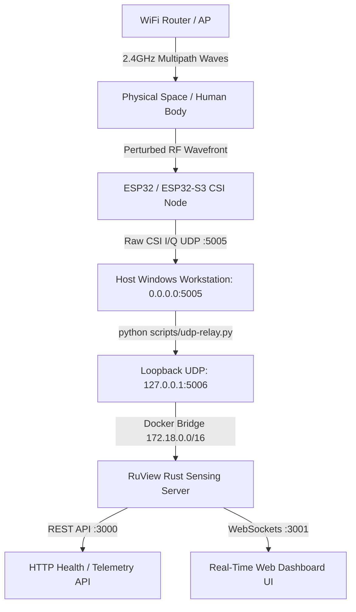
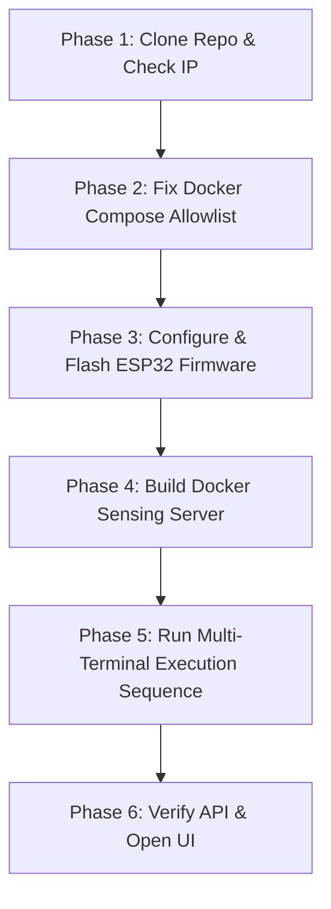

# RuView: WiFi CSI-Based Spatial Sensing & Presence Detection
## Complete Engineering, Fresh Setup & Debugging Manual

---

## 1. Executive Summary & Architecture Overview

**RuView** is an experimental radio-frequency (RF) sensing platform that captures raw **Channel State Information (CSI)** from commodity WiFi transmissions (IEEE 802.11n/ac) to detect physical presence, motion disturbances, room occupancy heuristics, and respiratory vital signs without cameras, LiDAR, or dedicated radar hardware.

This manual is written so that **anyone starting completely from scratch on a fresh machine can set up, configure, flash, and run the entire pipeline end-to-end without hitting the dozens of undocumented networking, allowlist, and parser pitfalls.**



---

## 2. Hardware & Software Prerequisites

Before starting, ensure you have the following hardware and software installed on your machine.

### 2.1 Hardware Requirements
- **1x ESP32 or ESP32-S3 Development Board** (e.g., ESP32-WROOM-32, NodeMCU, or ESP32-S3-DevKitC-1).
- **1x Micro-USB or USB-C Data Cable** (must support data transfer, not charge-only).
- **1x 2.4 GHz WiFi Router or Mobile Hotspot** (configured with a standard 2.4 GHz 802.11b/g/n SSID).
- **1x Windows Host PC** (Windows 10/11 x64, 4+ CPU cores, minimum 8GB RAM, 20GB+ free disk space).

### 2.2 Software Tools to Install on Host PC
1. **Git for Windows:** [git-scm.com](https://git-scm.com/)
2. **Docker Desktop for Windows:** [docker.com](https://www.docker.com/products/docker-desktop/) *(Ensure WSL2 backend is enabled during installation)*.
3. **Python 3.8+:** [python.org](https://www.python.org/) *(Check "Add Python to PATH" during installation)*.
4. **USB-to-UART Bridge VCP Drivers:** (Usually **CP210x** or **CH340/CH341** depending on your ESP32 board).
5. **ESP-IDF Toolchain (Optional if using pre-compiled binaries, mandatory if compiling firmware):** [docs.espressif.com](https://docs.espressif.com/projects/esp-idf/en/latest/esp32/get-started/) or VS Code ESP-IDF Extension.

---

## 3. Step-by-Step Fresh Setup Guide (Zero to Running)

Follow these phases sequentially when starting on a fresh computer.



---

### Phase 1: Clone Repository & Identify Host IP Address

1. Open PowerShell and clone the official RuView repository:
   ```powershell
   cd C:\Users\Aeromac-6\Downloads
   git clone https://github.com/ruvnet/RuView.git
   cd RuView
   ```

2. Identify your Windows machine's local IPv4 address:
   ```powershell
   ipconfig
   ```
   *Look for your active WiFi or Ethernet adapter `IPv4 Address` (e.g., `192.168.29.122`).* **Note this IP down — you will need it for the ESP32 firmware.**

---

### Phase 2: CRITICAL Configuration Fix (Docker Subnet Allowlist)

> [!WARNING]
> **Must Do Before Building:** By default, RuView's Docker Compose file only allows UDP packets from `172.17.0.0/16`. When Docker Compose builds its network on Windows, it assigns subnet `172.18.0.0/16`. Without this fix, **packets will reach the container but will be silently dropped by the allowlist filter.**

1. Open `docker/docker-compose.yml` in a text editor (e.g. VS Code or Notepad).
2. Locate the `sensing-server` service configuration and find the `--udp-allow` argument:
   ```yaml
   # BEFORE (Will drop packets on Windows Docker):
   - "--udp-allow"
   - "172.17.0.0/16"
   ```
3. Change it to allow the `172.18.0.0/16` subnet:
   ```yaml
   # AFTER (Correct):
   - "--udp-allow"
   - "172.18.0.0/16"
   ```
4. Save the file.

---

### Phase 3: Configure & Flash ESP32 / ESP32-S3 Firmware

> [!TIP]
> **Official Reference Tutorial:** For an in-depth, community-validated guide on ESP32-S3 flashing, board pinouts, and antenna calibration, refer to [RuView Issue #34: ESP32-S3 CSI Pipeline End-to-End Setup Tutorial](https://github.com/ruvnet/RuView/issues/34).

The ESP32 firmware source is located in `firmware/esp32-csi-node`.

1. **Configure WiFi & Target Host Parameters:**
   Open `firmware/esp32-csi-node/main/main.c` (or run `idf.py menuconfig` if using ESP-IDF) and configure:
   - **WiFi SSID:** Your 2.4GHz network name (e.g., `MyHomeWiFi`).
   - **WiFi Password:** Your WiFi password.
   - **Target Host IP:** Your Windows host IPv4 address found in Phase 1 (e.g., `192.168.29.122`).
   - **Target UDP Port:** `5005`.
   - **WiFi Rate / Channel:** Set to Channel `1`, `6`, or `11` with `HT20` / `MCS0` for deterministic subcarrier extraction.

2. **Build and Flash to ESP32 / ESP32-S3:**
   Connect your ESP32 / ESP32-S3 board via USB, then in the ESP-IDF terminal run:
   ```powershell
   cd firmware/esp32-csi-node

   # For standard ESP32:
   idf.py set-target esp32
   # For ESP32-S3:
   # idf.py set-target esp32s3

   idf.py build
   idf.py -p COM3 flash monitor   # Replace COM3 with your actual serial port
   ```
3. **Verify Serial Boot:**
   The serial monitor should output:
   ```text
   WiFi connected. IP: 192.168.29.50
   CSI collector initialized. Streaming UDP to 192.168.29.122:5005
   yield=34pps motion=0.00 presence=0.00
   ```
   *Disconnect the serial monitor or leave the board plugged in.*

---

### Phase 4: Build the Docker Sensing Server

From the repository root (`C:\Users\Aeromac-6\Downloads\RuView`):

1. Clean any old build cache to avoid storage exhaustion:
   ```powershell
   docker system prune -f
   ```
2. Build the Rust `sensing-server` container:
   ```powershell
   docker compose -f .\docker\docker-compose.yml build sensing-server
   ```
   *Wait for the Docker build to complete successfully.*

---

### Phase 5: The Daily Multi-Terminal Run Routine

You must run the system using **separate PowerShell windows** in this exact order.

#### Terminal 1 — Start the Rust Sensing Server
```powershell
cd C:\Users\Aeromac-6\Downloads\RuView

# Set mandatory local development environment variables
$env:RUVIEW_ALLOW_UNAUTHENTICATED="1"
$env:CSI_SOURCE="esp32"
$env:RUST_LOG="info"

# Start the container
docker compose -f .\docker\docker-compose.yml up sensing-server
```

*Expected Terminal 1 Startup Log:*
```text
sensing-server  | [INFO] UDP listening on 0.0.0.0:5005
sensing-server  | [INFO] HTTP server listening on 0.0.0.0:3000
sensing-server  | [INFO] WebSocket server listening on 0.0.0.0:3001
```

---

#### Terminal 2 — Start the Python UDP Relay
Open a second PowerShell window:
```powershell
cd C:\Users\Aeromac-6\Downloads\RuView

python .\scripts\udp-relay.py `
  --listen-port 5005 `
  --forward-port 5006 `
  --verbose
```

*Expected Terminal 2 Log:*
```text
udp-relay: listening on 0.0.0.0:5005 -> forwarding to 127.0.0.1:5006
udp-relay: collapses multi-source UDP to a single loopback source so Docker Desktop on Windows forwards every packet (issue #374).
```

---

#### Terminal 3 — Power On / Boot the ESP32 Node
Plug the ESP32 node into USB power (or press the `EN` / `RST` button on the board).

Within 3–5 seconds, observe the live logs flowing:

**In Terminal 2 (Relay):**
```text
[RELAY] Received 404 bytes from 192.168.29.50:52134 -> Forwarded to 127.0.0.1:5006
```

**In Terminal 1 (Sensing Server):**
```text
sensing-server  | [INFO] UDP RECEIVED: src=172.18.0.1:xxxxx, len=404, first4=[01, 00, 11, C5]
sensing-server  | [INFO] ESP32 HEADER: node=1 ant=1 subs=192 freq=2462 ...
sensing-server  | [INFO] ===== ALLOWLIST CHECK: src=172.18.0.1 =====
sensing-server  | [INFO] ===== REACHED CSI DISPATCH =====
sensing-server  | [INFO] UDP DATAGRAM: ... magic=0xc5110001
sensing-server  | [INFO] ESP32 PARSED: node=1, subs=192, seq=1042
```

---

### Phase 6: Verify Backend Health & Open Web UI

Open a third PowerShell window (Terminal 3):

1. **Test Server Health:**
   ```powershell
   Invoke-RestMethod http://localhost:3000/health
   ```
   *Expected Response:*
   ```json
   {
     "clients": 0,
     "source": "esp32",
     "status": "ok",
     "tick": 3196
   }
   ```

2. **Test Live Sensing Data:**
   ```powershell
   Invoke-RestMethod http://localhost:3000/api/v1/sensing/latest
   ```
   *Expected Response:*
   ```json
   {
     "timestamp": 1724219400,
     "node_id": 1,
     "motion_level": 0.84,
     "presence_score": 14.32,
     "subcarrier_grid": 192,
     "rssi": -52,
     "vital_signs": {
       "breathing_bpm": 16.2,
       "heart_rate_bpm": 74.0,
       "confidence": 0.88
     }
   }
   ```

3. **Open the Dashboard UI:**
   Navigate in your browser to:
   ```
   http://localhost:3000/ui/index.html
   ```

---

## 4. Complete Debugging History & Problem Solutions (Issues 1 to 14)

This section documents every concrete issue and failure mode solved during bring-up.

### Issue 1 — ESP32 Was Not Booted
- **Symptom:** UI reports "No data yet", `/api/v1/sensing/latest` returns `{"status":"no data yet"}`.
- **Root Cause:** Sensing server is operational, but ESP32 is powered off.
- **Fix:** Boot the ESP32 after starting the server and relay. Backend health $\neq$ CSI data flow.

### Issue 2 — Windows Docker NAT UDP Packet Dropping (Issue #374)
- **Symptom:** ESP32 is transmitting on port 5005, but Docker container receives 0 packets.
- **Root Cause:** Docker Desktop for Windows drops inbound UDP datagrams arriving from external network adapters.
- **Fix:** Run `python .\scripts\udp-relay.py --listen-port 5005 --forward-port 5006`. This accepts external packets on the host and pushes them through `127.0.0.1:5006` loopback.

### Issue 3 — Server Refuses Unauthenticated Public Bind
- **Symptom:** Docker container crashes on startup with `[entrypoint] ERROR: refusing to start sensing-server with default posture: RUVIEW_API_TOKEN is unset AND bind is 0.0.0.0`.
- **Root Cause:** Built-in safety check refuses to expose unauthenticated WebSockets on `0.0.0.0`.
- **Fix:** Set `$env:RUVIEW_ALLOW_UNAUTHENTICATED="1"`, `$env:CSI_SOURCE="esp32"`, `$env:RUST_LOG="info"` before running `docker compose up`.

### Issue 4 — Packets Arriving but Dropped Before CSI Processing
- **Symptom:** Logs show `UDP RECEIVED` and `ESP32 HEADER`, but no `ESP32 PARSED`.
- **Root Cause:** Packet crossed Docker network successfully, but was blocked by an internal gate in the Rust server pipeline.

### Issue 5 — Subnet Allowlist Rejection (`172.17.0.0/16` vs `172.18.0.0/16`)
- **Symptom:** Server prints:
  ```text
  ===== ALLOWLIST CHECK: src=172.18.0.1 =====
  ===== PACKET DROPPED BY ALLOWLIST =====
  ```
- **Root Cause:** `docker-compose.yml` had hardcoded `--udp-allow 172.17.0.0/16`, but Windows Docker NAT assigned the container to subnet `172.18.0.0/16`.
- **Fix:** Edit `docker/docker-compose.yml` and change `--udp-allow` to `172.18.0.0/16`.

### Issue 6 — ESP32 Packet 20-Byte Wire Layout
The binary packet layout required by the Rust parser is:
```text
Offset       Size (Bytes)   Field Description
------------------------------------------------------------
0..3         4              Magic Number = 0xC5110001
4            1              Node ID (uint8)
5            1              Antenna count (n_antennas, uint8)
6..7         2              Subcarrier count (n_subcarriers, Little-Endian uint16)
8..11        4              Frequency in MHz (Little-Endian uint32)
12..15       4              Sequence number (Little-Endian uint32)
16           1              RSSI (int8)
17           1              Noise floor (int8)
18           1              PPDU type
19           1              Reserved byte
20..         ...            Interleaved I/Q bytes (I=1B, Q=1B per subcarrier)
```

### Issue 7 — 16-Bit Subcarrier Count Truncation Bug (`u16` vs `u8`)
- **Historical Bug:** An earlier parser version read only `buf[6]` as `u8`. When transmitting 256 subcarriers (`0x0100`), the low byte was read as `0`, failing packet validation.
- **Fix:** Subcarriers must be parsed as a 16-bit integer: `let n_subcarriers = u16::from_le_bytes([buf[6], buf[7]]);`.

### Issue 8 — Strict Packet-Length Validation Formula
The expected packet byte length is calculated as:
$$\text{Expected Len} = 20 + (\text{n\_antennas} \times \text{n\_subcarriers} \times 2)$$
- 1 antenna, 192 subcarriers $\to 20 + (1 \times 192 \times 2) = \mathbf{404\text{ bytes}}$
- 1 antenna, 128 subcarriers $\to 20 + (1 \times 128 \times 2) = \mathbf{276\text{ bytes}}$
- 1 antenna, 64 subcarriers $\to 20 + (1 \times 64 \times 2) = \mathbf{148\text{ bytes}}$

### Issue 9 — Dynamic Subcarrier Grid Switching (64 / 128 / 192)
- **Observation:** Under WiFi rate adaptation, ESP32 packet size fluctuates between 148, 276, and 404 bytes.
- **Fix:** `NodeState::accept_grid()` locks the feature extractor to the densest 192-subcarrier grid while continuing to record 64/128-subcarrier packets for node liveness.

### Issue 10 — Dissecting the 5-Stage Checkpoint Chain
To diagnose where packet processing stalls, follow this pipeline sequence:
1. `UDP RECEIVED` $\to$ Socket received bytes.
2. `ESP32 HEADER` $\to$ Magic number (`0xC5110001`) validated.
3. `ALLOWLIST CHECK` $\to$ Source IP in allowed CIDR (`172.18.0.0/16`).
4. `REACHED CSI DISPATCH` $\to$ Routed past vendor dispatch table.
5. `ESP32 PARSED` $\to$ I/Q samples extracted and pushed to DSP pipeline.

### Issue 11 — False-Alarm "Backend Unavailable" UI Notice
- **Symptom:** UI displays: `Backend not available. Start sensing server.`
- **Root Cause:** The UI displays this banner whenever `/api/v1/sensing/latest` has not yet received a packet, even if the Rust server is 100% healthy.
- **Diagnosis:** Run `Invoke-RestMethod http://localhost:3000/health`. If `status: ok` returns, the server is fine—you only need to boot/power the ESP32.

### Issue 12 — Host Storage Exhaustion & Docker Build Freeze
- **Symptom:** Windows drive $C:$ reached < 4 GB free, causing VS Code and Docker to hang.
- **Root Cause:** Docker build cache accumulated 20+ GB of dangling layers.
- **Fix:** Run `docker system prune -a --volumes` to recover space before running builds.

### Issue 13 — Rust Compilation Errors on Injected Diagnostics (`E0425`)
- **Symptom:** Rust build errors with `error[E0425]: cannot find value 'expected_len' in this scope`.
- **Root Cause:** Injected diagnostic print statements placed outside variable scope in `parse_esp32_frame()`.
- **Fix:** Keep edits strictly scoped inside function blocks and compile locally before building Docker images.

### Issue 14 — Packets Dropped Before Parser Execution
- **Summary:** If `UDP RECEIVED` and `ESP32 HEADER` appear in the log but `ESP32 PARSED` does not, the issue is almost always **subnet allowlist rejection**, not a parser crash.

---

## 5. Port Locking Diagnostic Script

If port `5005` or `5006` is already occupied by a previously crashed process, run this in PowerShell to find and kill it:

```powershell
$endpoint = Get-NetUDPEndpoint -LocalPort 5005 -ErrorAction SilentlyContinue
if ($endpoint) {
    $proc = Get-Process -Id $endpoint.OwningProcess
    Write-Host "Port 5005 locked by PID $($proc.Id) ($($proc.ProcessName))" -ForegroundColor Red
    Stop-Process -Id $proc.Id -Force
    Write-Host "Killed PID $($proc.Id). Port 5005 is now free." -ForegroundColor Green
} else {
    Write-Host "Port 5005 is free." -ForegroundColor Green
}
```

---

## 6. Theoretical Physics & Signal Processing Reference

### 6.1 CSI vs. RSSI
- **RSSI (Received Signal Strength Indicator):** Single scalar power measurement in dBm. Collapses all multipath reflections into one value; cannot separate moving reflectors from static walls.
- **CSI (Channel State Information):** Complex matrix of amplitude attenuation and phase shift across 56 individual OFDM subcarriers:
  $$H_i = |H_i| e^{j \angle H_i} = I_i + j Q_i \quad (i \in [1, 56])$$

### 6.2 Fresnel Zone Multipath Perturbation
Radio waves propagate along direct and reflected paths. The 1st Fresnel zone defines the ellipsoidal region where path length variation changes by fractions of the wavelength ($\lambda \approx 12.5\text{ cm}$ at $2.4\text{ GHz}$):
$$r_1 = \sqrt{\frac{\lambda d_1 d_2}{d_1 + d_2}}$$
A moving chest wall (breathing) modulates subcarrier phase and amplitude through constructive and destructive multipath interference.

### 6.3 Signal Processing Pipeline
1. **Multi-Band TDM:** Channels 1, 6, 11 aggregated $\to$ 168 virtual subcarriers.
2. **Hampel Filter:** Outlier rejection using rolling median and Median Absolute Deviation (MAD).
3. **Bandpass Filtering:**
   - **Breathing:** 0.1–0.5 Hz bandpass $\to$ Zero-crossing count $\to$ 6–30 BPM.
   - **Heart Rate:** 0.8–2.0 Hz bandpass $\to$ 40–120 BPM.
4. **AI Backbone (AETHER):** Contrastive self-supervised 128-dimensional embedding for room fingerprinting and anomaly detection.

---

## 7. Airborne & UAV / Drone Feasibility Analysis

Mounting an active CSI sensor directly to a flying drone introduces severe noise sources:
1. **Prop-Wash & Blade Flashing:** Propeller blades at 3,000–8,000 RPM create high-frequency Doppler clutter across all subcarriers.
2. **Motor Vibration:** Structural oscillation creates mechanical phase jitter in the ESP32 crystal oscillator.
3. **Translational Motion:** Airframe drift makes all static objects (floor, walls) appear as moving reflectors, swamping minute human chest movements.

### Recommended UAV Architectures:
- **Mode A (Hover-and-Scan):** The drone flies to a coordinate, holds a stationary GPS/Optical-Flow hover, and collects a 10–30s CSI window with a high-pass motor vibration filter.
- **Mode B (Ground-Relay Mesh):** The drone lands or drops stationary ESP32-S3 nodes on the ground and acts as a wireless mesh relay back to the base station.

---

## 8. Current Known Limitations & Reality Check

1. **Person Counting Is an Arithmetic Heuristic:**
   - Single-node counting is an arithmetic slot-capacity heuristic tracking subcarrier diversity (`edge_processing.c:481`), not true human body segmentation.
   - Multi-person tracking requires $\ge 2$ multistatic nodes.
2. **Operational Sensing Range:**
   - The through-wall operational range has **not yet been characterized in controlled testing**. It must be evaluated experimentally per environment.
3. **Calibration Requirement:**
   - Requires a 30–60 second undisturbed ambient baseline calibration upon startup.
   - Active pedestal fans or moving doors will trigger presence alerts unless baseline filtered.

---

## 9. Quick-Reference Daily Cheat Sheet

Keep this handy for running the project in daily development:

```powershell
# ==========================================
# TERMINAL 1: Sensing Server (Docker)
# ==========================================
cd C:\Users\Aeromac-6\Downloads\RuView
$env:RUVIEW_ALLOW_UNAUTHENTICATED="1"
$env:CSI_SOURCE="esp32"
$env:RUST_LOG="info"
docker compose -f .\docker\docker-compose.yml up sensing-server

# ==========================================
# TERMINAL 2: UDP Relay (Python)
# ==========================================
cd C:\Users\Aeromac-6\Downloads\RuView
python .\scripts\udp-relay.py --listen-port 5005 --forward-port 5006 --verbose

# ==========================================
# HARDWARE: Boot ESP32 Node
# ==========================================
# Plug ESP32 into USB / Power. Target host: <Host-IP>:5005

# ==========================================
# TERMINAL 3: Health & UI Verification
# ==========================================
Invoke-RestMethod http://localhost:3000/health
Invoke-RestMethod http://localhost:3000/api/v1/sensing/latest
# Open Browser: http://localhost:3000/ui/index.html
```

---

## 10. Official Upstream References & Resources

- **RuView Repository:** [github.com/ruvnet/RuView](https://github.com/ruvnet/RuView)
- **ESP32-S3 End-to-End Pipeline Tutorial:** [RuView Issue #34: ESP32-S3 CSI Pipeline Setup](https://github.com/ruvnet/RuView/issues/34)
- **Docker Multi-Source UDP Forwarding Discussion:** [RuView Issue #374: UDP Relay for Windows Docker NAT](https://github.com/ruvnet/RuView/issues/374)
- **Zero CSI Readings Troubleshooting:** [RuView Issue #521: Zero readings on ESP32 CSI callback](https://github.com/ruvnet/RuView/issues/521)

