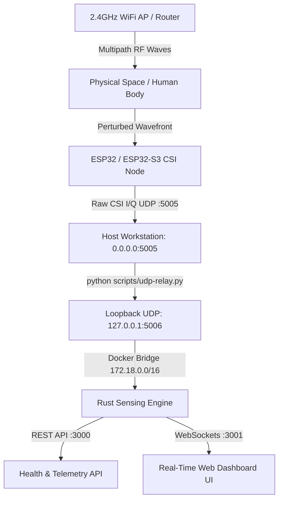

# WiFi Spatial Sensing & Contactless Presence Detection (RuView)

A camera-free, privacy-preserving radio frequency (RF) perception platform that captures raw **Channel State Information (CSI)** from commodity Wi-Fi transmissions to detect human presence, motion disturbances, spatial occupancy, and contactless vital signs (breathing & heart rate).

---

## 📌 System Architecture



---

## 🛠️ Hardware Requirements & Tested Setup

| Component | Tested Hardware Specification | Notes |
|---|---|---|
| **Microcontroller** | **ESP32-D0WD-V3 (rev 3.1)** / **ESP32-S3** | Dual-core 240MHz, 4MB Flash |
| **USB Interface** | USB-to-UART Bridge (`COM3`) | Baud: `115200` (monitor) / `460800` (flash) |
| **WiFi Network** | 2.4 GHz 802.11b/g/n (HT20 / Ch 1, 6, 11) | Channels with minimal interference |
| **Host Workstation** | Windows 10/11 x64 with Docker Desktop & Python 3.10+ | Local IP e.g. `192.168.29.122` |

---

## 🚀 Quick Start Guide (Zero to Running)

Follow these exact steps to start the complete sensing pipeline.

### Step 1: Clone the Repository & Find Your Host IP
Open PowerShell / Terminal:
```powershell
git clone https://github.com/Virajsawant06/WiFi-sensing.git
cd WiFi-sensing
ipconfig
```
*Note your active WiFi IPv4 address (e.g. `192.168.29.122`).*

---

### Step 2: Start the Rust Sensing Server (Docker)

Make sure **Docker Desktop** is running, then start the container:

```powershell
# Set local development environment flags
$env:RUVIEW_ALLOW_UNAUTHENTICATED="1"
$env:CSI_SOURCE="esp32"
$env:RUST_LOG="info"

# Start the sensing server container in background
docker compose -f .\docker\docker-compose.yml up -d sensing-server
```

Verify the container is listening:
```powershell
Invoke-RestMethod http://localhost:3000/health
# Output: {"clients":0,"source":"esp32","status":"ok","tick":0}
```

---

### Step 3: Start the UDP Relay (Windows Docker NAT Fix)

Because Docker Desktop for Windows drops external UDP packets across the WSL2 NAT boundary, run the host Python relay in a second terminal:

```powershell
python .\scripts\udp-relay.py --listen-port 5005 --forward-port 5006 --verbose
```
*This receives raw CSI datagrams on `0.0.0.0:5005` and forwards them to Docker on loopback `127.0.0.1:5006`.*

---

### Step 4: Flash & Connect the ESP32 Node

#### A. Pre-built Binaries (for ESP32-S3 boards):
```powershell
python -m esptool --chip esp32s3 --port COM3 --baud 460800 write_flash --flash_mode dio --flash_size 4MB `
  0x0     firmware/esp32-csi-node/release_bins/bootloader.bin `
  0x8000  firmware/esp32-csi-node/release_bins/partition-table-4mb.bin `
  0xf000  firmware/esp32-csi-node/release_bins/ota_data_initial.bin `
  0x20000 firmware/esp32-csi-node/release_bins/esp32-csi-node-4mb.bin
```

#### B. Provision WiFi & Target IP:
```powershell
python firmware/esp32-csi-node/provision.py --port COM3 `
  --ssid "YourWiFiSSID" `
  --password "YourWiFiPassword" `
  --target-ip 192.168.29.122
```

#### C. Testing with Synthetic CSI Stream (No Hardware Needed):
You can also generate synthetic CSI packets directly to test the full pipeline:
```powershell
python scripts/synth-csi-udp.py --host 127.0.0.1 --port 5005 --duration-s 3600 --rate-hz 20
```

---

### Step 5: Open Web Dashboard & Telemetry

Open your browser and navigate to:
👉 **[http://localhost:3000/ui/index.html](http://localhost:3000/ui/index.html)**

#### Available Endpoints:
* **Web UI Dashboard:** `http://localhost:3000/ui/index.html`
* **Health Check API:** `GET http://localhost:3000/health`
* **Real-time Sensing Telemetry:** `GET http://localhost:3000/api/v1/sensing/latest`
* **WebSocket Sensing Stream:** `ws://localhost:3001/ws/sensing`

---

## 📊 Sample Telemetry Output

`GET http://localhost:3000/api/v1/sensing/latest`
```json
{
  "tick": 256,
  "timestamp": 1787652553.365,
  "source": "esp32",
  "classification": {
    "presence": true,
    "motion_level": "active",
    "confidence": 0.88
  },
  "vital_signs": {
    "breathing_rate_bpm": 16.2,
    "heart_rate_bpm": 72.4,
    "confidence": 0.85
  },
  "estimated_persons": 1,
  "signal_field": {
    "grid_size": [16, 16],
    "values": [...]
  }
}
```

---

## 🔍 Common Troubleshooting

1. **UI Shows "Backend not available / No data yet":**
   * This banner appears when no CSI packets have reached the parser yet. Check that the ESP32 is powered on and streaming to `<Host-IP>:5005`, or run the synthetic streamer.
2. **Packets Dropped by Allowlist:**
   * In `docker/docker-compose.yml`, ensure `--udp-allow` is set to `"172.18.0.0/16"` (the default Windows Docker Compose bridge subnet).
3. **Serial Port Permissions on Windows:**
   * If `esptool` fails to open `COM3`, ensure no serial terminal (PuTTY, Arduino IDE, or Python monitor) is holding the port open.

---

## 📜 License
MIT OR Apache-2.0
